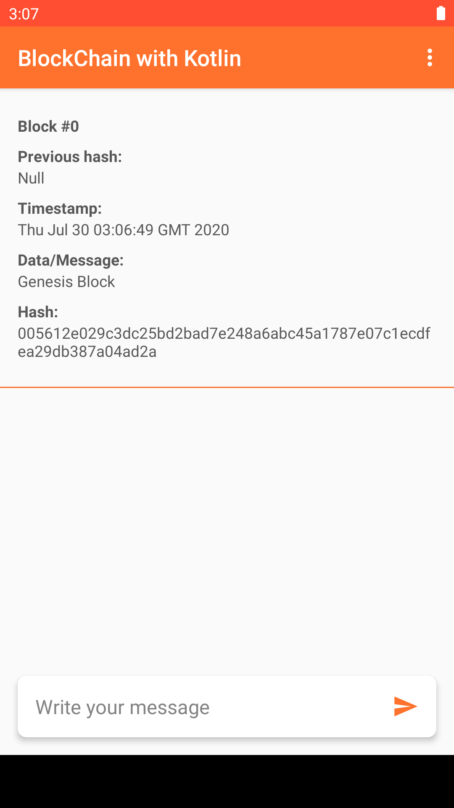
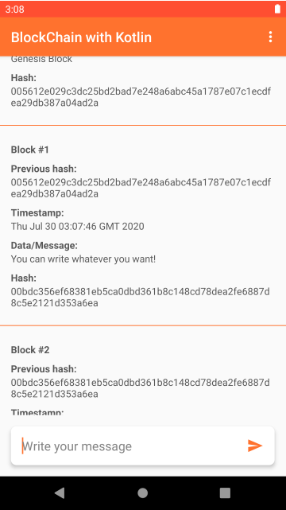
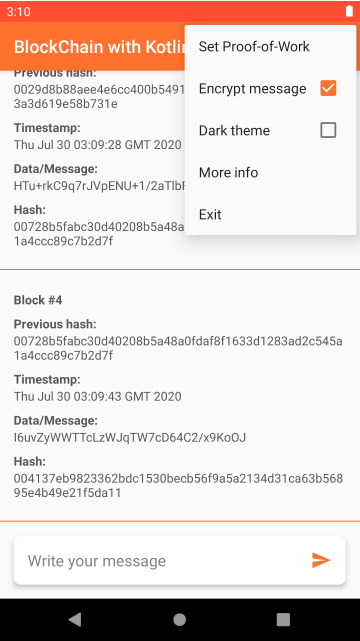
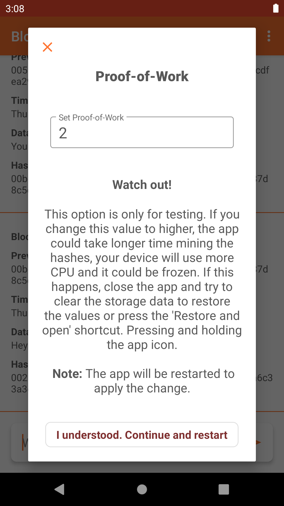
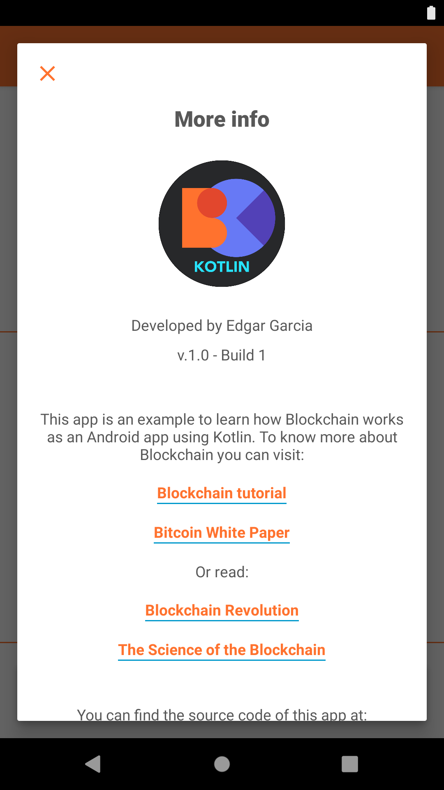
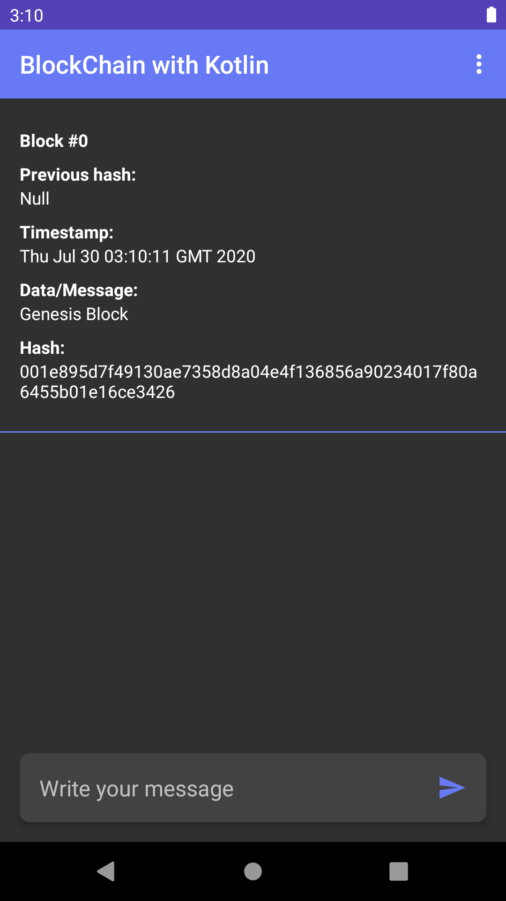

# Android Blockchain Example
This mobile app is an example to learn how Blockchain works as an Android app using Java.


Getting started
---------------
You can clone or fork this repo and use it freely. If there are build errors, in Android Studio go to `Tools -> Android -> SDK Manager` and install any available updates. Then go to `Build -> Clean Project` and finally `Build -> Rebuild Project`.

Remember, you will need getting the last API version and updates. This project runs with AndroidX and new Material Design, so, if you want to keep this, leave the dependencies as they are.

#### build.gradle
```gradle
dependencies {
    implementation 'com.google.android.material:material:1.0.0'
    implementation 'androidx.appcompat:appcompat:1.0.2'
    implementation 'androidx.legacy:legacy-support-v4:1.0.0'
    implementation 'androidx.constraintlayout:constraintlayout:1.1.3'
    implementation 'androidx.coordinatorlayout:coordinatorlayout:1.0.0'
}
```


Screenshots
-----------
The first block (Genesis block) will be inserted whenever you open the app.




A hash check of three blocks.




You can encrypt the message to insert it in the Blockchain.




You can set the 'Proof-of-work' to test the app on your device.




Get more info about this app and the Blockchain.




Switch to dark theme when you need it or in Battery saver.




Contact
----------
For anything about the project, you can email me at eagb.mb@gmail.com.
You can visit my [website](https://eagb-corp.web.app).
